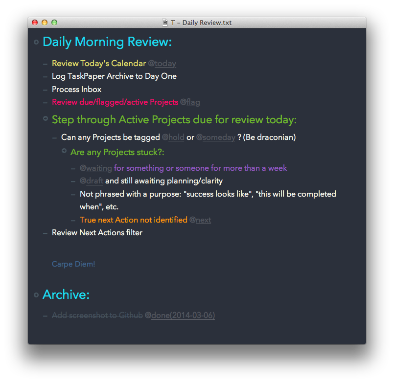

Monokai-Spacegray-Veneer-for-TaskPaper
======================================



This is a new theme for [TaskPaper 2.x](http://www.hogbaysoftware.com/products/taskpaper). It is heavily influenced by variations of Monokai (see details below) and wildly interpreted and tamed by myself. Lately, I've been favouring the font **Avenir Next**  for a clean view of my tasks, but that's easy enough to change to your preferred typeface — although you'll lose half of my double entendre (see what I did there?)

I've already begun adapting this to the upcoming [3.0 version of Taskpaper](http://support.foldingtext.com/discussions/development-versions/94-taskpaper-3-dev-build-123) which will use an entirely different theming structure with a LESS frontend (and shared with FoldingText). I'll release that once the dust settles on development...and I figure it all out!

## Color Influences
* Monokai (a by now legendary dark theme with vibrant color highlights by [Wimer Hazenberg](http://www.monokai.nl/blog/2006/07/15/textmate-color-theme/))
* An updated interpretation by Daniel Diekmeier called [Monokai Spacegray](https://github.com/danieldiekmeier/Monokai-Spacegray) - a recent Sublime Text theme.
* Apple's own Spacegray movement of late (my iPhone color of choice!) although from a cursory search, BMW's use of the color term pre-dates this with their 2010 M3.

Apologies to anyone else I've begged borrowed and stealed from to cobble this together. I've been tweaking others' taskpaper themes for years now and lost track of which layouts came from where.

## Installation

It's a simple 3 step  process:

1. Copy the **Monokai Spacegray Veneer.taskpapertheme** to this location:
    /Users/yourusername/Library/Application Support/TaskPaper/Themes
2. Open TaskPaper and select this new theme that appears under **Theme Options**.
3. Be more productive in your night and day! — this step not always so simple ;-)

## Styles Supported:

* Group Headers (may ber perceived as Project Level 1 depending on your content)
* There are 3 levels of Projects, each consecutively smaller in size.
* Supported tags are:
    * today
    * next
    * flag
    * waiting
    * done
* Notes are dark blue and 1 pt size smaller.

Suggestions welcome here but you can certainly customise your own (see next section). I strive to keep this as minimal as possible to not be too busy or dilute the value of calling attention to important blocks.. 

## Customisation

Hopefully you'll find the code minimally documented and clearly organised enough to tweak further. Most likely you'll want to customise your own tag names you wish to draw extra attention to (although I think less is more in this regard).

### To change Fonts:
Search for any instances of **Avenir Next**. There's a few in case you wanted to get fancy like I did while testing but then ended up streamlining the look in the end. **Helvetica Neue Light** is a trendy choice for top-level headers of late.

### To change Tags:
All you need to change is the ```matchesQuery=""``` value. If you wanted to be thorough and permanent, just be sure to change every other matching tag name in that section.

### To add new Tags:
You can copy and paste an existing Tag section. Change all the tag names. Adjust color/styles as desired.

Hope you enjoy!

---

> ### Aside : These Are a Few of My Favourite Scripts
> Part of the thinking behind the tags and processes I use is influenced by some excellent scripts I rely upon to automate my workflow. These currently include:
> 
> * Brett Terpstra's excellent [Log TaskPaper Archives to Day One](http://brettterpstra.com/2012/02/23/log-taskpaper-archives-to-day-one/). With this you can skip the **Archive Done Tasks** command. It appends a tag with the enclosing Project name (I wish it did all levels of projects in that tree branch —as [PlainTasks](https://github.com/aziz/PlainTasks) does [TODO]), moves it to Archive project at bottom of file, logs to [Day One](http://dayoneapp.com) app — brilliant, still works a year later!
> * A few choice ones from [Rob Trew's tree-tools](https://github.com/RobTrew/tree-tools). Mostly TaskPaperViews, although I have these duplicated in TextExpander now.
> * Pedro Lobo and Phillip Gruneich's powerful [TaskPaper-Actions](https://github.com/pslobo/TaskPaper-Actions)

---

## TODO

* add a style for @drafts
    * these should be dealt with rather quickly and could do with standing out.
* reconsider style choice for @next
    * I'm ending up with a sea of orange from **TaskPaper-Actions** mentioned above.